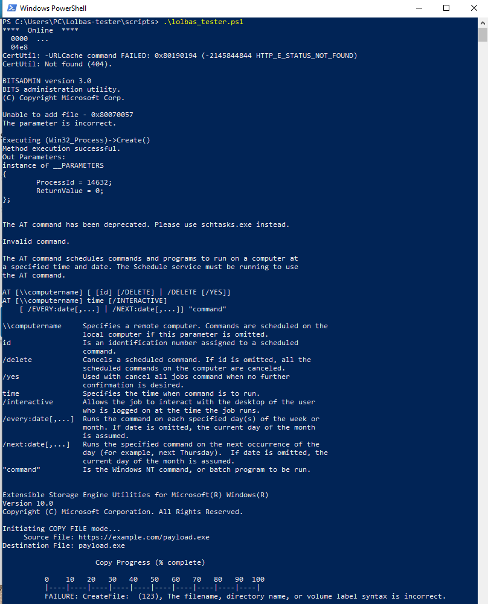
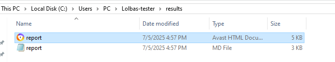
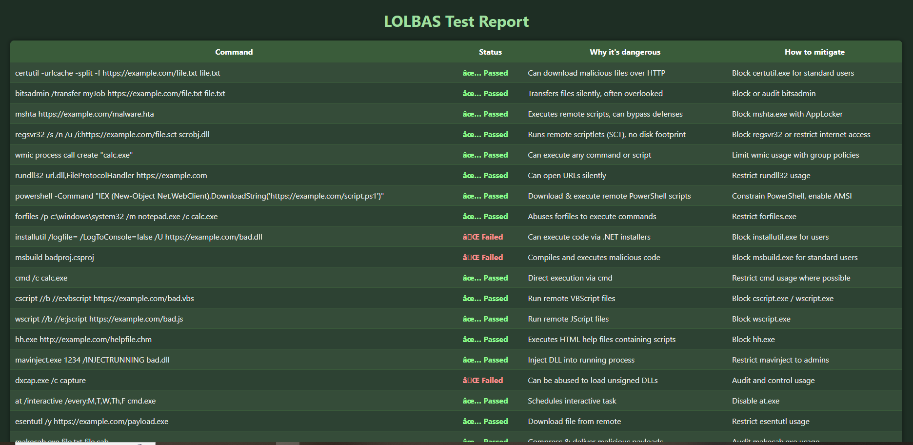

# Lolbas-tester

A simple Windows LOLBAS (Living Off The Land Binaries And Scripts) command tester for basic pentesting and security awareness.

---

## What is this?

This project runs a set of popular LOLBAS commands on a Windows machine and reports which commands succeed or fail.  
It helps penetration testers and security professionals quickly check if certain binaries or scripts are usable on a system.

---

## Features

- Tests ~50 popular LOLBAS commands via PowerShell script  
- Generates a clear report showing pass/fail for each command  
- Easy to run on Windows PCs with PowerShell  
- Includes explanations and mitigation tips (in docs)  

---

## Requirements

- Windows 10 or later  
- PowerShell (version 5 or higher)  
- Git (optional, for cloning repo)  

---

## How to use

### 1. Clone this repository or download ZIP:

```powershell
git clone https://github.com/Dariuslukosius/lolbas-tester.git
cd lolbas-tester\scripts
```

### 2. Important: If you get an error about execution policy like:

```
cannot be loaded because running scripts is disabled on this system
```

then do the following:

- Open PowerShell **as Administrator**

- Temporarily allow script execution by running:

```powershell
Set-ExecutionPolicy -ExecutionPolicy Bypass -Scope Process
```

### 3. Run the test script:

```powershell
.\lolbas_tester.ps1
```

---

## Results

The script generates test reports in the `results` folder:

- `report.html` — a colored and styled HTML report for easier reading in browsers  
- `report.md` — a simple Markdown report

  
 
---

## Troubleshooting

- If you get errors about blocked scripts, make sure you run PowerShell with sufficient privileges and set the execution policy as described above.  
- For any other issues, check PowerShell version (`$PSVersionTable.PSVersion`) and update if needed.
